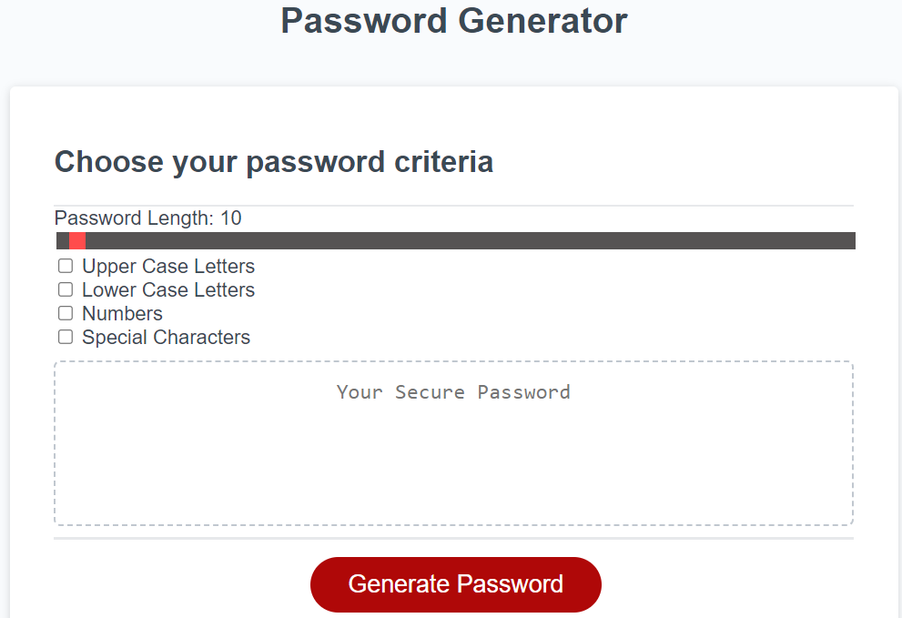

# password-generator-code

# Description

I have developed this password generator web page using HTML, CSS and Javascript as part of challenge given in the Birmingham University Bootcamp program.

It can generate a password of 8 to 128 length containing special charactors, upper case letters, lower case letters and numbers.

I have done some extra work that includes slider, checkboxes to get the password length and other criterias from user.

This has been an amazing learning opportunity to impletement the skills and knowledge aquired during the classes and sessions.

This showcases my project work and the corresponding technologies I am learning.

# website
https://lalitakapadia.github.io/password-generator-code/

