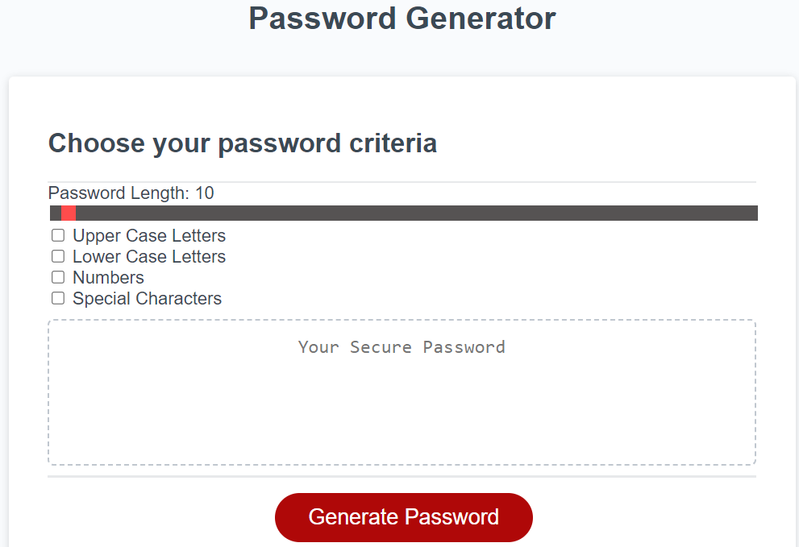

# password-generator-code

## Description

i have developed this password generator page using HTML, CSS and Javascript as part of challenge given in the Birmingham University Bootcamp program.

this app will run in the browser.
it's includes 8 to 128 length, special charactor, uppercase, lowercase and numbers.
i have done some extra work that includes slider, checkboxes as well.

This has been an amazing learning opportunity to impletement the skills and knowledge aquired during the classes and sessions.

This showcases my project work and the corresponding technologies I am learning.

# website
https://lalitakapadia.github.io/password-generator-code/

